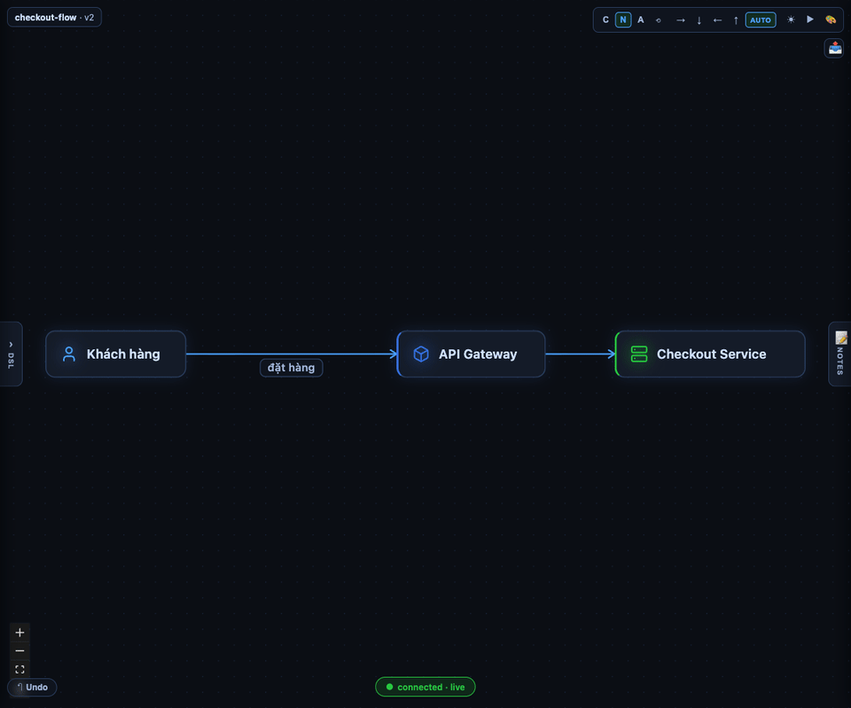
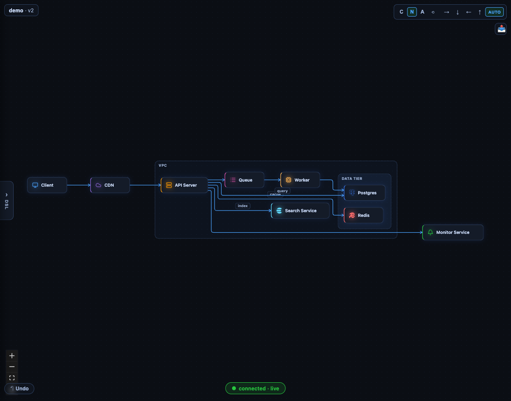
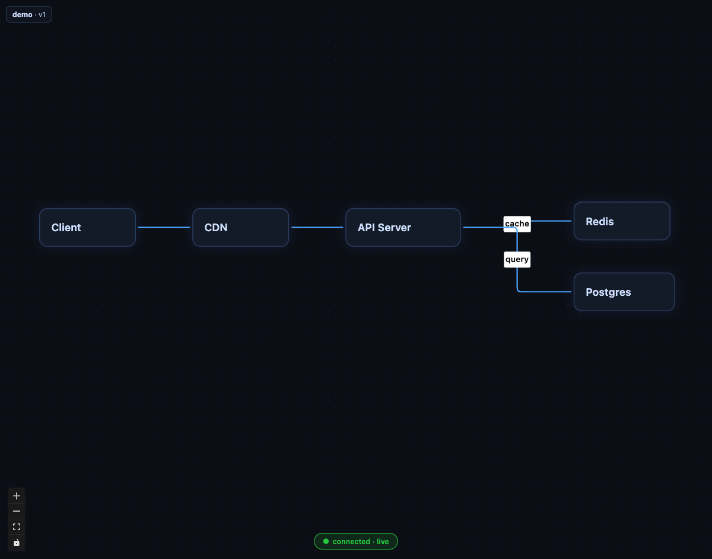
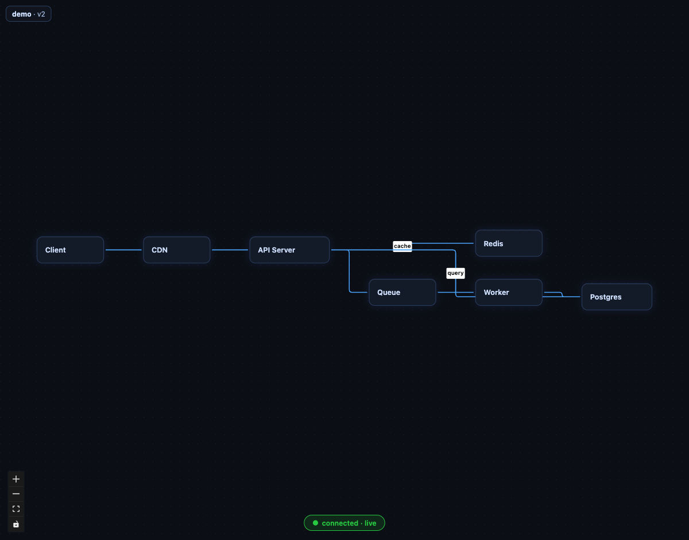
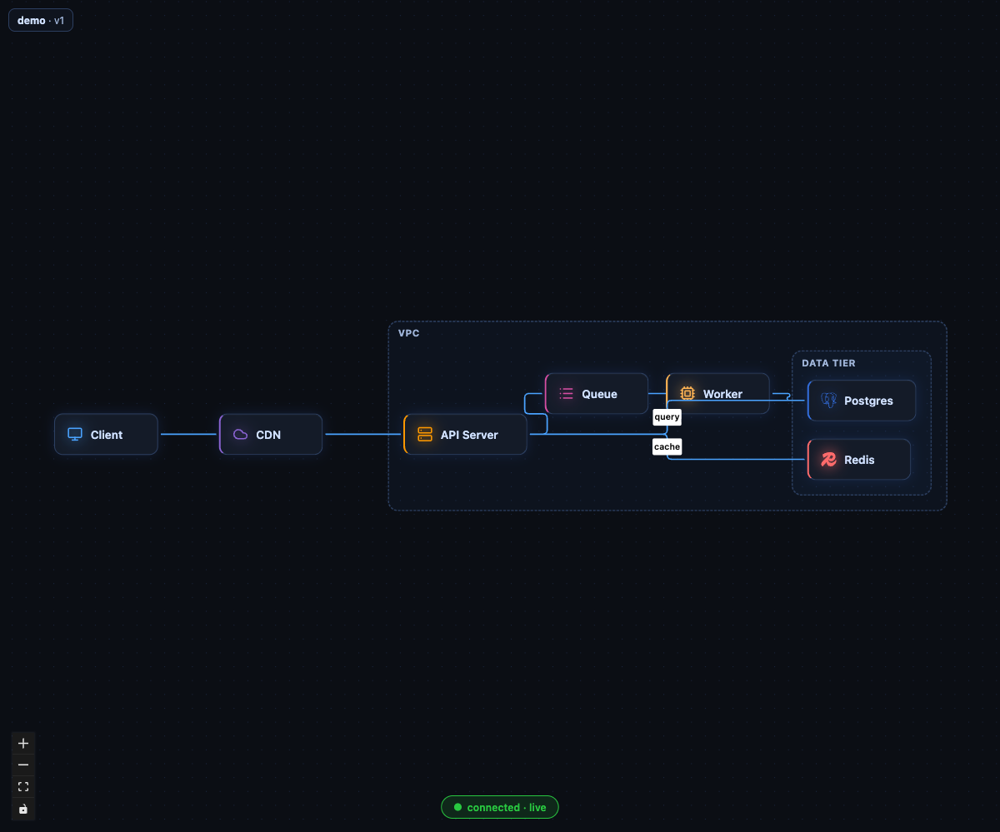
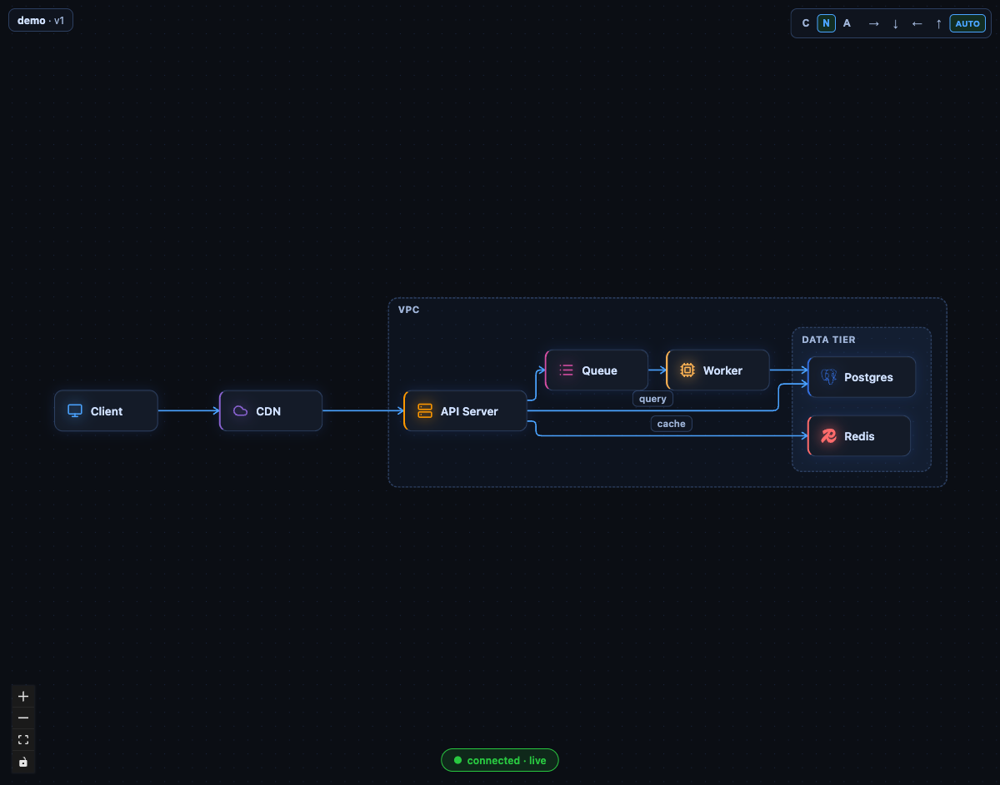

# diagram-copilot

[](https://github.com/xidoke/diagram-copilot/actions/workflows/ci.yml)
[](LICENSE)

> Trạng thái: **v1.0** — 21 MCP tools, eval 10/10 first-try. Xem [ROADMAP](docs/ROADMAP.md) cho lộ trình tiếp theo.

**System Design Studio, local-first, AI-native.** Bạn trò chuyện với Claude Code, sơ đồ kiến trúc đẹp kiểu eraser hiện ra và tiến hóa ngay trên canvas — DSL text là nguồn sự thật duy nhất, chạy hoàn toàn trên máy bạn (Node server local, port 4747), không cần API key riêng ngoài Claude Code đã có sẵn.


*Bốn lượt chat: "thiết kế hệ thống checkout" → "tách tier thanh toán" → "chống oversell bằng queue" → "thêm observability" — mỗi câu, Claude ghi DSL qua MCP và canvas tự vẽ lại.*


*Một phiên Claude Code thật (`claude -p`, headless) đang tạo/sửa sơ đồ qua MCP — canvas cập nhật live, không có bàn tay người can thiệp vào DSL.*

---

## Quickstart — 5 phút / 5 minutes

**Tiếng Việt**

1. Clone repo và cài dependency:
   ```bash
   git clone https://github.com/xidoke/diagram-copilot.git
   cd diagram-copilot
   pnpm install
   ```
2. Build toàn bộ workspace (bắt buộc trước khi chạy bản `dist/`):
   ```bash
   pnpm -r build
   ```
3. Chạy server — chọn một trong hai cách:
   ```bash
   # Cách A: chạy bản đã build, đúng như production/npx sẽ chạy
   node packages/server/dist/index.js

   # Cách B: chạy dev, tự restart khi sửa code (tsx watch, port 4747 + web 4700)
   pnpm dev
   ```
   Server mặc định lắng nghe `http://localhost:4747`, workspace mặc định `~/diagram-copilot/workspace`. Đổi bằng cờ CLI:
   `--port <n>` · `--workspace <dir>` · `--export-dir <dir>` · `--export-root <dir>` (whitelist thêm cho `export_diagram`, lặp lại được).
   Ngoài cờ, có thể khai báo thêm root qua biến môi trường `DIAGRAM_COPILOT_EXPORT_ROOTS` (nhiều path ngăn bằng `:`, hỗ trợ `~`) — CỘNG THÊM vào whitelist, không thay thế. Hữu ích khi chạy `pnpm dev` (không truyền được cờ CLI) và cần export PNG vào một repo code khác, ví dụ:
   ```bash
   DIAGRAM_COPILOT_EXPORT_ROOTS=~/cho-phien/docs/diagrams pnpm dev
   ```
4. Đăng ký MCP endpoint với Claude Code (một lần):
   ```bash
   claude mcp add --transport http diagram-copilot http://localhost:4747/mcp
   ```
5. Mở Claude Code, chat thử: *"thiết kế hệ thống rút gọn URL, có cache Redis"* — sơ đồ sẽ hiện ra trên `http://localhost:4747`.

**English**

1. Clone and install:
   ```bash
   git clone https://github.com/xidoke/diagram-copilot.git
   cd diagram-copilot
   pnpm install
   ```
2. Build the whole workspace (required to run the built `dist/` output):
   ```bash
   pnpm -r build
   ```
3. Run the server — either:
   ```bash
   # A: run the built bin, same as production/npx
   node packages/server/dist/index.js

   # B: dev mode, auto-restarts on save (tsx watch, server :4747 + web :4700)
   pnpm dev
   ```
   Defaults: `http://localhost:4747`, workspace `~/diagram-copilot/workspace`. Override with
   `--port <n>` · `--workspace <dir>` · `--export-dir <dir>` · `--export-root <dir>` (extra whitelist root for `export_diagram`, repeatable).
   Besides the flag, extra roots can be declared via the `DIAGRAM_COPILOT_EXPORT_ROOTS` env var (multiple paths joined with `:`, `~` supported) — ADDED to the whitelist, never replacing it. Handy with `pnpm dev` (no CLI flags to pass) when you need to export a PNG into a different code repo, e.g.:
   ```bash
   DIAGRAM_COPILOT_EXPORT_ROOTS=~/cho-phien/docs/diagrams pnpm dev
   ```
4. Register the MCP endpoint with Claude Code (once):
   ```bash
   claude mcp add --transport http diagram-copilot http://localhost:4747/mcp
   ```
5. Open Claude Code and try: *"design a URL shortener with a Redis cache"* — the diagram appears live at `http://localhost:4747`.

---

## MCP tools (11)

Đăng ký thật trong `packages/server/src/mcp/handler.ts` khi server chạy qua CLI (workspace + history + snapshot đều được wire) — không phải 13 như mô tả task ban đầu, xem ghi chú cuối README.

| Tool | Việc gì |
|---|---|
| `ping` | Health check — version, workspace dir, diagram đang mở. |
| `get_dsl_guide` | Trả về toàn bộ tài liệu cú pháp arch-dsl (xem [`docs/DSL.md`](docs/DSL.md)). Gọi trước khi viết/sửa DSL. |
| `list_icons` | Liệt kê/tìm icon id dùng trong `[icon: ...]` (lọc theo `query`). |
| `list_diagrams` | Liệt kê các `.arch` trong workspace đang mở. |
| `open_diagram` | Mở/tạo một diagram theo tên, đặt làm active. |
| `get_diagram` | Đọc DSL hiện tại của diagram active — luôn gọi trước khi sửa. |
| `set_diagram` | Ghi đè toàn bộ DSL (whole-file write); validate trước, lỗi trả về `line:col` để tự sửa. |
| `snapshot_diagram` | Lưu diagram hiện tại thành một bước tiến hóa (`.stepN.arch` + nhãn) cho học tập. |
| `undo_diagram` | Hoàn tác lần ghi gần nhất (kể cả do AI ghi đè), dùng ring buffer version. |
| `redo_diagram` | Làm lại sau khi undo. |
| `get_snapshot` | Yêu cầu canvas render PNG hiện tại — để Claude "nhìn" và tự verify. |

## Tài liệu

- **DSL reference:** [`docs/DSL.md`](docs/DSL.md) — cú pháp đầy đủ, bảng màu, alias icon, semantics (id vs label, comment-wins, implicit nodes).
- **Roadmap sản phẩm:** [`docs/ROADMAP.md`](docs/ROADMAP.md) — release train v0.1 → v2.0, module map M1–M8.
- **Workflow vibe song song:** [`docs/WORKFLOW.md`](docs/WORKFLOW.md) — master điều phối + worker agents trong git worktree.
- **Design spec (v2):** [`docs/superpowers/specs/2026-07-02-diagram-copilot-design.md`](docs/superpowers/specs/2026-07-02-diagram-copilot-design.md)
- **Changelog:** [`CHANGELOG.md`](CHANGELOG.md)

## Kiến trúc (tóm tắt)

DSL kiểu eraser (Langium) → model (Zod) → auto-layout (elkjs) → render (React Flow, theme dark blueprint). Local Node server: serve canvas + WebSocket live-sync + MCP endpoint `/mcp` (Streamable HTTP, stateless, port 4747) cho Claude Code.

## Dev

- `pnpm install` rồi `pnpm dev` — chạy song song server (`tsx watch`, port 4747, tự restart khi sửa `packages/server` hoặc `packages/core`) + web (Vite, port 4700).
- Chạy riêng một bên: `pnpm dev:server` hoặc `pnpm dev:web`.
- Trước khi commit: `pnpm -r build` và `pnpm -r test`.

## Screenshots

| | |
|---|---|
|  File `.arch` → sơ đồ trên canvas (v0.1) |  Sửa file → tự vẽ lại (v0.1) |
|  Group lồng nhau + icon + màu (v0.2) |  Cạnh orthogonal theo ELK bend-point (v0.2) |
|  Claude Code thật lái canvas qua MCP (v0.3) | |

## Spike đã verify

`spikes/reactflow-elk-layout/` — nested VPC/subnet + cross-tier edges, layout ~60ms. `npm i && npm run dev` (port 5178).

## License

[MIT](LICENSE) © 2026 xidoke.
